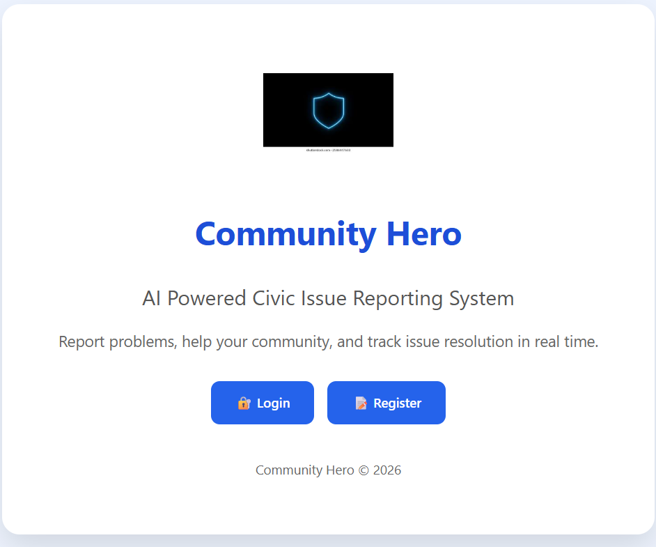
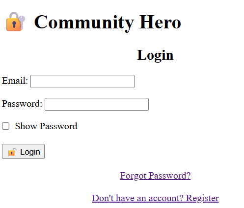
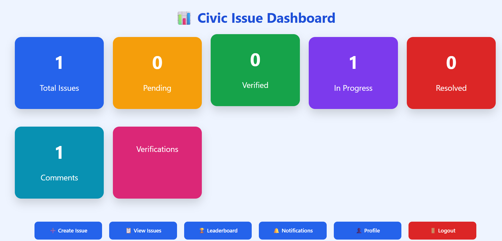
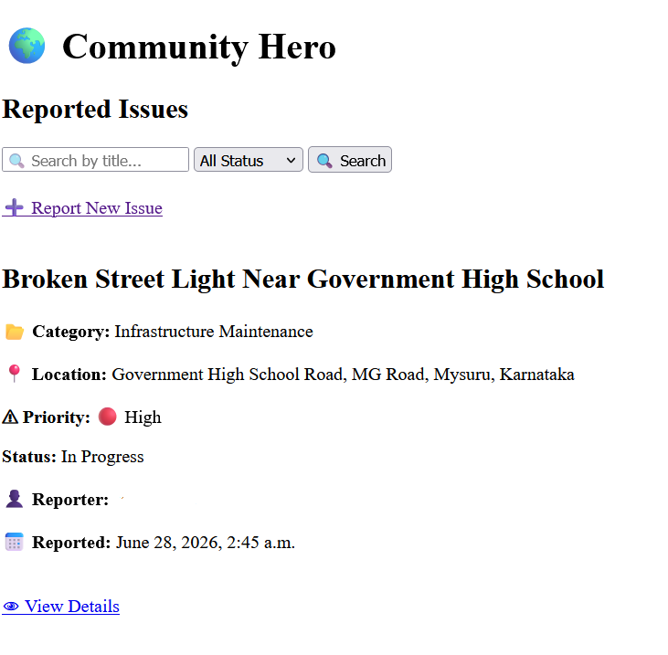
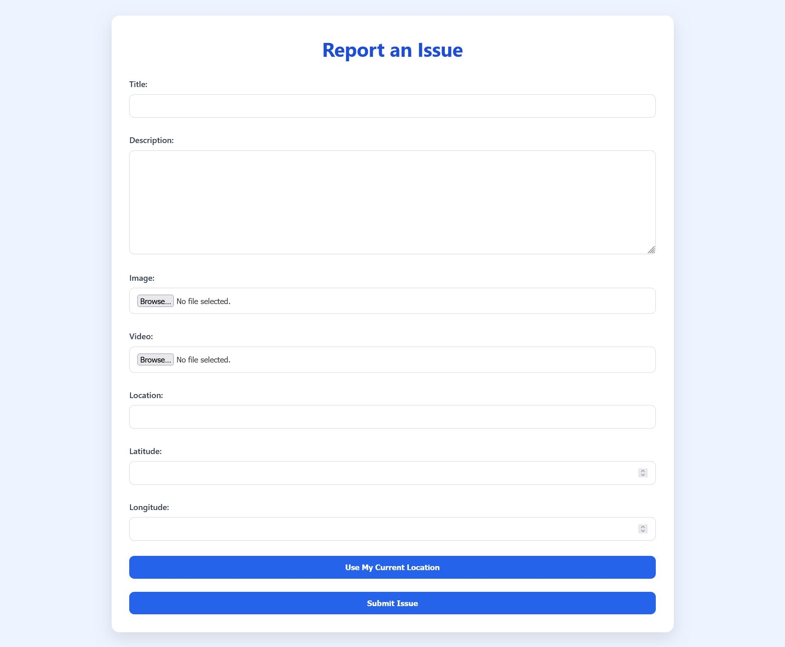
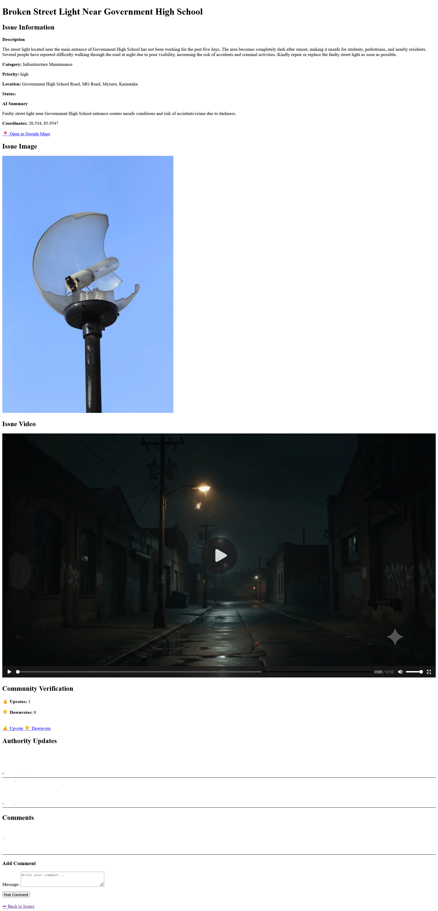
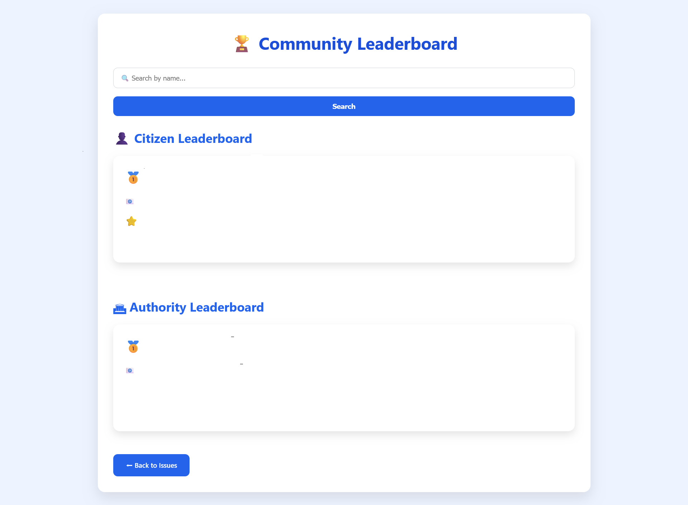
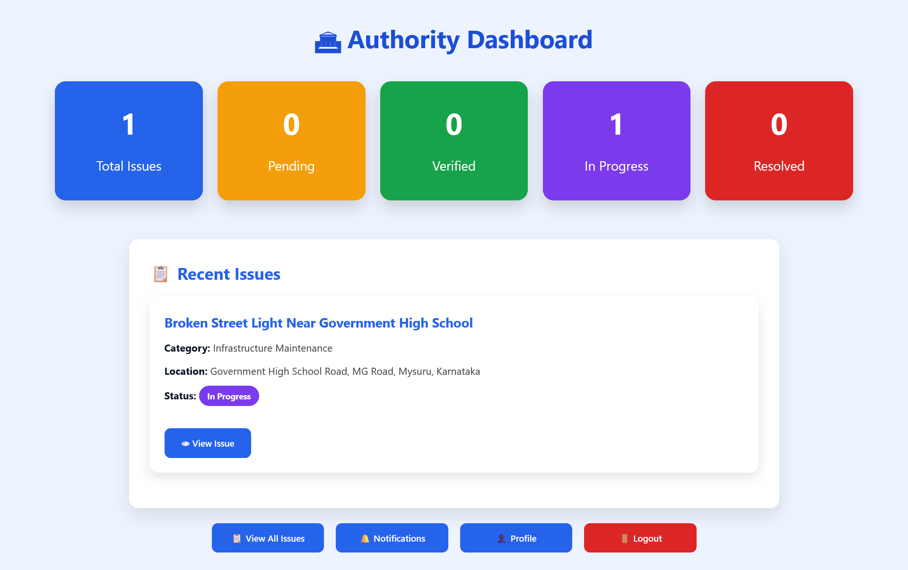

# 🏙️ CommunityHero

CommunityHero is an AI-powered community issue reporting platform built using Django. It enables citizens to report civic issues such as potholes, broken street lights, garbage accumulation, water leakage, and more, while allowing authorities to manage and resolve them efficiently.

---

## ✨ Features

- 👤 Citizen & Authority Login
- 📱 OTP Verification
- 📝 Report Community Issues
- 🤖 AI-generated Issue Summary (Google Gemini)
- 📍 Location Support
- 💬 Comments & Notifications
- 🏆 Leaderboard
- 👨‍💼 Authority Dashboard
- 👤 User Profile

---

## 🛠️ Tech Stack

- Python
- Django
- SQLite
- HTML
- CSS
- JavaScript
- Google Gemini API

---

# 📷 Screenshots

## Home Page



---

## Login



---

## Dashboard



---
## Issue List



---

## Create Issue



---

## Issue Detail



---

## Leaderboard



---

## Authority Dashboard



---

# 🚀 Installation

```bash
git clone https://github.com/Sanskrutisoumya12/CommunityHero.git

cd CommunityHero

pip install -r requirements.txt

cd src

python manage.py migrate

python manage.py runserver
```

---

# 👩‍💻 Author

**Sanskruti Soumya Nayak**

---

# 📜 License

This project was developed for educational and hackathon purposes.
